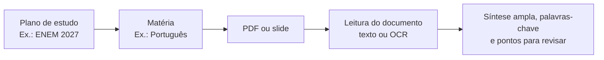

# organiza

### Um espaço pessoal para transformar materiais soltos em um plano de estudo claro.

ENEM · PAS · vestibulares · concursos públicos

---

## Por que existe

Estudar costuma envolver muitos PDFs, slides, apostilas e assuntos espalhados. O Organiza reúne esse material em um percurso simples: a pessoa escolhe uma prova, separa as matérias e mantém cada PDF com uma síntese, pontos de revisão e palavras-chave.

## A experiência de estudo

| Momento | O que acontece |
| --- | --- |
| **Criar um plano** | A pessoa dá um nome ao objetivo, como “Concurso Banco do Brasil”. |
| **Organizar matérias** | Cada assunto fica dentro do plano: Português, Matemática, Direito e assim por diante. |
| **Adicionar um material** | O PDF ou slide entra diretamente na matéria certa. |
| **Retomar o conteúdo** | A plataforma mostra uma síntese com páginas de referência, temas e pontos de revisão. |

## O que a plataforma oferece

| Área | Recursos |
| --- | --- |
| **Conta** | Cadastro, confirmação de e-mail, login e recuperação de senha. |
| **Planos** | Organização separada para cada prova ou objetivo. |
| **Matérias** | Biblioteca por assunto, sem misturar materiais de áreas diferentes. |
| **PDFs** | Upload, abertura do arquivo, resumo, palavras-chave e exclusão segura. |
| **Revisões** | Pontos extraídos do próprio material para orientar o próximo retorno ao conteúdo. |

## Resumo amplo do documento, sem custo de IA

O Organiza lê o PDF no próprio servidor e percorre diferentes partes do documento para que a síntese represente começo, meio e fim do conteúdo. Trechos repetidos, cabeçalhos, avisos de licença e enunciados de questões são reduzidos para destacar o que ajuda na revisão.

Slides e PDFs digitalizados que não possuem texto selecionável passam por OCR local. O arquivo não é enviado a uma IA nem a um serviço de resumo: o OCR transforma as imagens em texto dentro da plataforma e identifica os tópicos mostrados nos slides. Na primeira leitura por OCR, o servidor baixa e mantém em cache o modelo gratuito de idioma português; o PDF da pessoa permanece no ambiente da plataforma.

Cada trecho da síntese aponta a página de origem. As palavras-chave representam temas presentes no material; elas não afirmam frequência de cobrança em provas anteriores.

## Organização e segurança

- Cada conta visualiza somente os próprios planos e materiais.
- Todo PDF pertence a uma matéria e a um plano.
- A exclusão remove o PDF, a síntese, as palavras-chave e os registros de revisão vinculados.
- O e-mail é confirmado na criação da conta; a recuperação de senha usa links de uso único.

## Limites atuais

| Item | Regra |
| --- | --- |
| Arquivo | PDF de até 4 MB |
| Documento | Até 800 páginas quando o texto é selecionável |
| PDF digitalizado ou slides em imagem | Até 80 páginas processadas por OCR em uma análise |
| Hospedagem | Em produção, os arquivos usam o armazenamento configurado para a plataforma |

## Tecnologia

Construído com Next.js, TypeScript, Prisma e PostgreSQL. A leitura usa PDF.js, OCR local com Tesseract.js e não exige uma chave de IA ou cobrança por documento.

---

  organiza · estudar com mais clareza, um material por vez.

