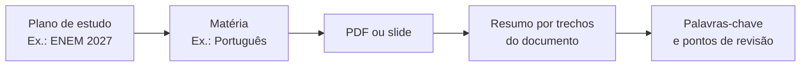

# organiza

### Um espaço pessoal para transformar materiais soltos em um plano de estudo claro.

ENEM · PAS · vestibulares · concursos públicos

---

## Por que existe

Estudar costuma envolver muitos PDFs, slides, apostilas e assuntos espalhados. O Organiza reúne esse material em um percurso simples: a pessoa escolhe uma prova, separa as matérias e mantém cada PDF com seu resumo, seus pontos de revisão e suas palavras-chave.

## A experiência da pessoa que estuda

| Momento                | O que acontece                                                                                     |
| ---------------------- | -------------------------------------------------------------------------------------------------- |
| **Criar um plano**     | A pessoa dá um nome ao objetivo, como “Concurso Banco do Brasil”.                                  |
| **Organizar matérias** | Cada assunto fica dentro do plano: Português, Matemática, Direito e assim por diante.              |
| **Adicionar um PDF**   | O documento entra diretamente na matéria certa.                                                    |
| **Retomar o conteúdo** | A plataforma apresenta uma síntese de leitura, páginas de referência, temas e pontos para revisar. |

## O que a plataforma oferece

| Área         | Recursos                                                               |
| ------------ | ---------------------------------------------------------------------- |
| **Conta**    | Cadastro, confirmação de e-mail, login e recuperação de senha.         |
| **Planos**   | Organização separada para cada prova ou objetivo.                      |
| **Matérias** | Biblioteca por assunto, sem misturar materiais de áreas diferentes.    |
| **PDFs**     | Upload, abertura do arquivo, resumo, palavras-chave e exclusão segura. |
| **Revisões** | Espaço preparado para acompanhar os próximos retornos ao conteúdo.     |

## Resumo do PDF, sem custo de IA

O resumo é gerado no próprio servidor. A plataforma extrai o texto selecionável do PDF, ignora cabeçalhos repetidos, avisos de licença e enunciados de questões, e percorre diferentes partes do documento para evitar um resumo concentrado apenas no começo.

Cada trecho exibido aponta a página de onde foi retirado. As palavras-chave representam temas presentes no material; elas não afirmam frequência de cobrança em provas anteriores.

> PDFs digitalizados como imagem não possuem texto selecionável. Para esse caso, o arquivo precisa passar por OCR antes de ser adicionado.

## Organização e segurança

- Cada conta visualiza somente os próprios planos e materiais.
- O PDF sempre pertence a uma matéria e a um plano.
- A exclusão remove o PDF, o resumo, as palavras-chave e os registros de revisão vinculados.
- O e-mail é confirmado na criação da conta; a recuperação de senha usa links de uso único.

## Limites atuais

| Item       | Regra                                                                       |
| ---------- | --------------------------------------------------------------------------- |
| Arquivo    | PDF de até 4 MB                                                             |
| Documento  | Até 200 páginas por análise                                                 |
| Texto      | PDF com texto selecionável                                                  |
| Hospedagem | Em produção, os arquivos usam o armazenamento configurado para a plataforma |

## Tecnologia

Construído com Next.js, TypeScript, Prisma e PostgreSQL. A leitura do PDF usa PDF.js e funciona localmente, sem chave de API ou cobrança por documento.

---

  organiza · estudar com mais clareza, um material por vez.

