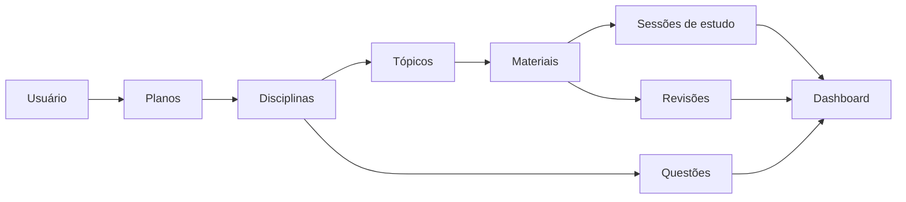

# Organiza

Uma plataforma pessoal para **organizar, estudar, praticar, revisar e acompanhar a evolução**. O foco é transformar materiais dispersos em uma rotina clara de estudo, para ENEM, vestibulares, concursos ou qualquer objetivo individual.

```text
Objetivo → Disciplina → Tópico → Material → Estudo → Prática → Revisão
```

## O que está implementado

| Área | Recursos |
| --- | --- |
| Conta | Cadastro, verificação de e-mail, login, logout e recuperação de senha. |
| Planos | Objetivos de estudo, disciplinas, tópicos e subtópicos. |
| Biblioteca | PDFs, slides, documentos, textos, anotações e links vinculados ao conteúdo certo. |
| PDF | Upload, leitura, posição da página, conclusão, resumo local, palavras-chave e pontos de estudo. |
| Sessões | Timer, pausa, finalização, dificuldade e histórico de tempo estudado. |
| Prática | Cadastro de questões, tentativas, acertos, erros e explicação da resposta. |
| Revisões | Agenda automática e manual, pendências, atrasos e histórico de conclusão. |
| Dashboard | Dados reais da semana, continuar estudando, progresso por disciplina e sessões recentes. |

## Como os dados aparecem

- **Tempo estudado** vem apenas de sessões finalizadas.
- **Tópicos estudados** consideram tópicos de materiais usados em sessões na semana atual.
- **Aproveitamento** considera tentativas de questões registradas na semana atual.
- **Progresso por disciplina** é calculado pelos materiais concluídos sobre os materiais vinculados à disciplina.
- A plataforma mostra estados vazios quando ainda não há dados, sem usar números de demonstração.

## Arquitetura


```mermaid
flowchart LR
  U[Usuário] --> P[Planos]
  P --> D[Disciplinas]
  D --> T[Tópicos]
  T --> M[Materiais]
  M --> S[Sessões de estudo]
  D --> Q[Questões]
  M --> R[Revisões]
  S --> DASH[Dashboard]
  Q --> DASH
  R --> DASH
```

## Tecnologias

- Next.js 15 e React 19
- TypeScript
- Prisma ORM e PostgreSQL/Neon
- Tailwind CSS
- Zod para validação
- PDF.js e Tesseract.js para processamento local de PDFs
- Resend para e-mails transacionais
- Vercel Blob para armazenamento de arquivos em produção

## Configuração local

O projeto requer Node.js 22.13 ou superior, um banco PostgreSQL e um arquivo `.env` local. Nunca publique valores reais de ambiente.

| Variável | Uso |
| --- | --- |
| `DATABASE_URL` | Conexão PostgreSQL/Neon. |
| `AUTH_SECRET` | Assinatura de sessão. |
| `APP_URL` | URL pública da aplicação, como `http://localhost:3000`. |
| `RESEND_API_KEY` | Envio de confirmação e recuperação de senha. |
| `EMAIL_FROM` | Remetente verificado no Resend. |
| `BLOB_READ_WRITE_TOKEN` | Upload de arquivos na Vercel, quando aplicável. |

Com as variáveis configuradas, os comandos principais são:

```bash
npm install
npm run prisma:generate
npm run prisma:migrate
npm run dev
```

## Qualidade e validação

```bash
npm run lint
npm run typecheck
npm run test:pdf
npm run build
```

## Limites atuais

- O processamento de PDF é local e não usa IA paga.
- PDFs digitalizados e slides podem usar OCR local.
- As questões são cadastradas manualmente pelo próprio usuário.
- A pesquisa global e um editor rico de anotações ainda não foram implementados.

## Roadmap

- Pesquisa global em planos, tópicos, materiais, anotações e questões.
- Editor de anotações mais completo.
- Leitor de PDF integrado com anotações por página.
- Repetição espaçada avançada como etapa futura.

## Segurança

- Segredos são lidos somente por variáveis de ambiente.
- Cada consulta de dados é associada ao usuário autenticado.
- Senhas são armazenadas como hash.
- Tokens de confirmação e redefinição têm uso controlado e expiração.
- Arquivos de ambiente e uploads locais estão ignorados pelo Git.
